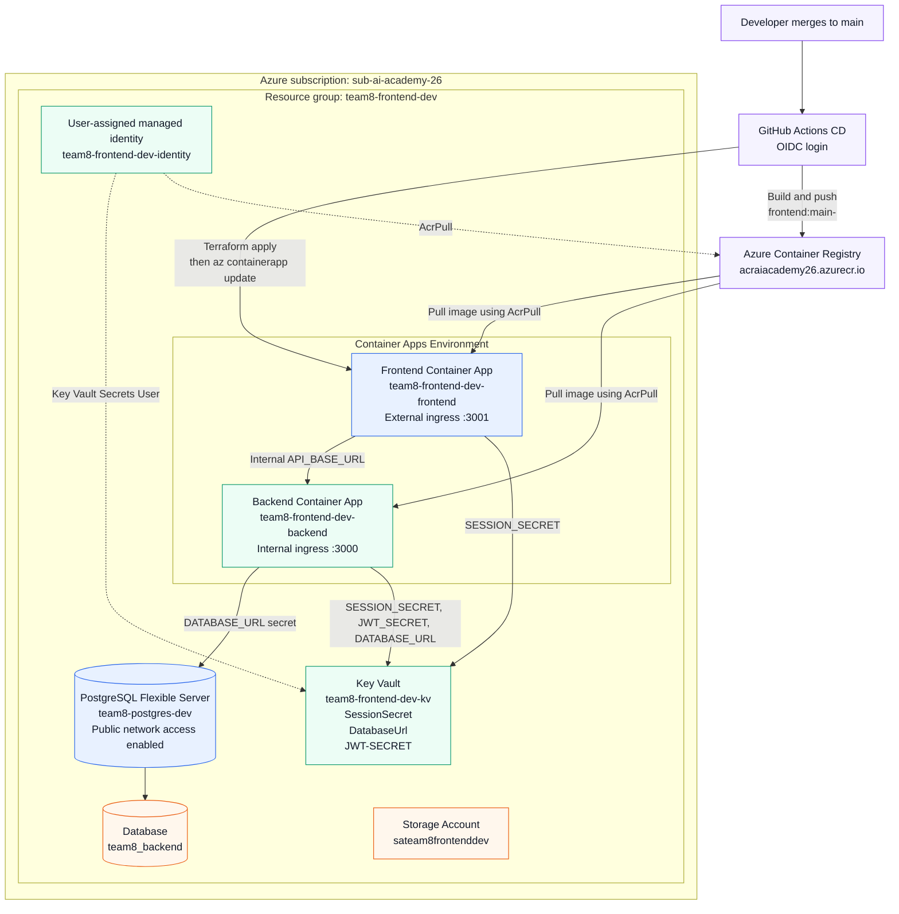

# Azure Infrastructure

The diagram below reflects the infrastructure currently defined in `my_infrastructure/`.

## Current network behavior

- The frontend has external ingress and is the public entry point.
- The backend has `external_enabled = false`, so its Container App ingress is internal to the Container Apps environment.
- PostgreSQL currently has `public_network_access_enabled = true` and an Azure-services firewall rule. It is **not yet private-only**.
- Container Apps use the user-assigned managed identity to pull images from ACR and read secrets from Key Vault.
- CD pushes a commit-specific frontend image tag and updates the frontend Container App to that tag. The `latest` tag is also pushed for convenience.

## Main deployment flow

1. A merge to `main` triggers GitHub Actions after CI succeeds.
2. CD builds and pushes the frontend image to ACR with `main-<commit SHA>` and `latest` tags.
3. Terraform applies the infrastructure configuration.
4. Azure CLI updates the frontend Container App to the commit-specific image tag.
5. Container Apps creates a new revision for the updated frontend image.
